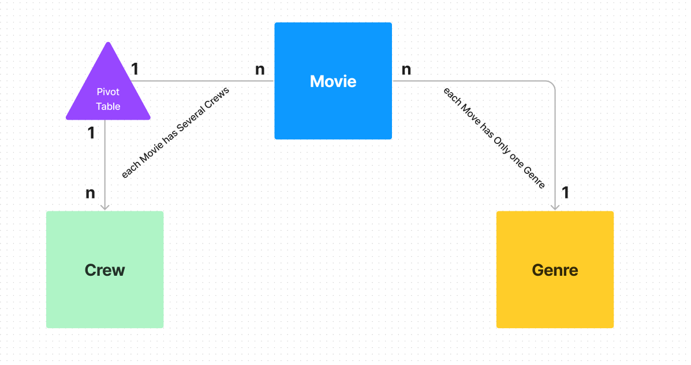

# Mini IMDB

## Implementation

### Models
- Crew , Genre , Movie

### DB Structure

    
   

### Api Functionalities
- I used the **Repository Design Pattern**
- You can find each model Repository in `app/Repositories`
- every Model has an Interface called `ModelNameRepositoryInterface.php` and Implemented in `ModelNameRepository.php`

### Routes

- Api's are implemented based on RESTFUL Api rules
- They are in `routes/api.php

### Validations

- for each `store` and `update` method , there is a request rule in `app/Http/Requests/`

### Api Docs

- For better understanding of how the Api's works import the `postman.json` from `/project/Docs/Postman/` inside you postman
- You can see the `Api`, `Header` and `body` of each Api and the result that I got in tests
- I tested each functionality of the project with Postman

### Factory and Seeding
- In `/database/factories` you can see the Factory for each Model.
- In `/database/seeders` Implemented Seeder for each on those Models.
- for accessing the data in you database first run the `Crew` seeder then `Genre` Seeder and then `Movie` Seeder